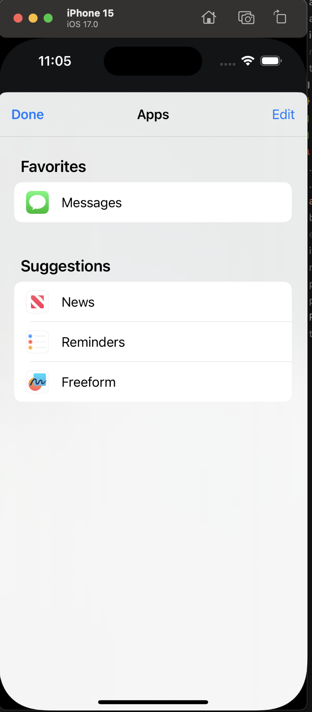

## I'm trying to add share extension functionality on expo app, using expo-apple-targets. actually pulling target inside the project and changing bundler identifier the share extension doesn't appear

### Steps followed

1. Create an expo project
2. Copied target of share extension
3. Inside share.entitlements replace <string>group.com.bacon.rnbeta</string> to <string>group.<myBundleIdentifier></string>
4. npx expo prebuild
5. npx expo run:ios

